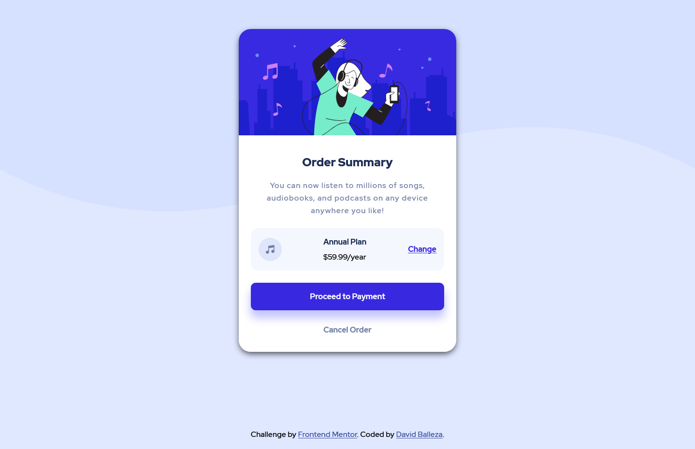

# Frontend Mentor - Order summary card solution

This is a solution to the [Order summary card challenge on Frontend Mentor](https://www.frontendmentor.io/challenges/order-summary-component-QlPmajDUj). Frontend Mentor challenges help you improve your coding skills by building realistic projects. 

## Table of contents

- [Overview](#overview)
  - [Link](#link)
  - [Screenshot](#screenshot)
- [My process](#my-process)
  - [Built with](#built-with)
  - [Useful resources](#useful-resources)
- [Author](#author)

## Overview

### Link

-Live demo: [https://davidballezaa.github.io/frontend-mentor/order-summary-component/](https://davidballezaa.github.io/frontend-mentor/order-summary-component/)

### Screenshot

## My process

### Built with

- Semantic HTML5 markup
- CSS custom properties
- Flexbox
- Mobile-first workflow

### Useful resources

- [Developer Mozilla Top Border Box](https://developer.mozilla.org/es/docs/Web/CSS/border-top-left-radius) - This helped me because I didn't know how to use the border-radius property just in the top of my image, for the right top border you just change left with right.
- [Box Shadow Generator](https://cssgenerator.org/box-shadow-css-generator.html) - This is an amazing tool that I used for creating box shadows.

## Author

- Frontend Mentor - [@davidballezaa](https://www.frontendmentor.io/profile/davidballezaa)
- Twitter - [@davidballezaa](https://www.twitter.com/davidballezaa)

