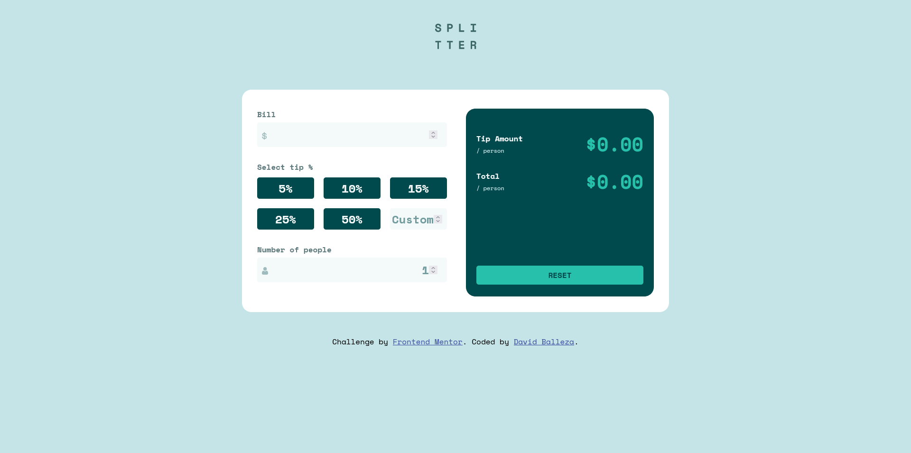
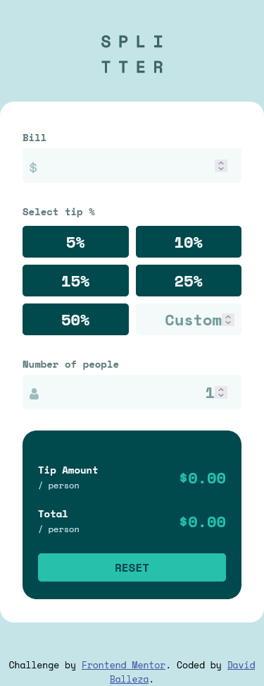

# Frontend Mentor - Tip calculator app solution

This is a solution to the [Tip calculator app challenge on Frontend Mentor](https://www.frontendmentor.io/challenges/tip-calculator-app-ugJNGbJUX). Frontend Mentor challenges help you improve your coding skills by building realistic projects. 

## Table of contents

- [Overview](#overview)
  - [Link](#link)
  - [Screenshot](#screenshot)
- [My process](#my-process)
  - [Built with](#built-with)
- [Author](#author)

## Overview

### Link

-Live demo: [https://davidballezaa.github.io/frontend-mentor/tip-calculator-app/](https://davidballezaa.github.io/frontend-mentor/tip-calculator-app/)

### Screenshot
-Desktop view:

-Mobile view:  

## My process

### Built with

- Semantic HTML5 markup
- CSS custom properties
- Flexbox
- CSS Grid
- Mobile-first workflow

## Author

- Github - [@davidballezaa](https://www.github.com/davidballezaa)
- Frontend Mentor - [@davidballezaa](https://www.frontendmentor.io/profile/davidballezaa)
- Twitter - [@davidballezaa](https://www.twitter.com/davidballezaa)

